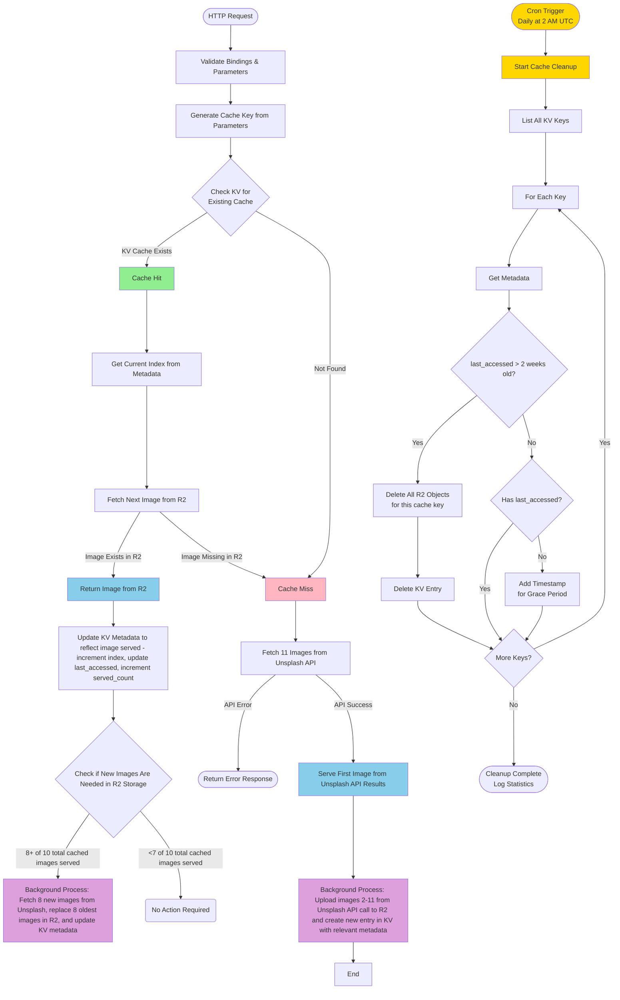

# Unsplash Caching System Architecture

This document explains how the intelligent caching system works in the Unsplash Cloudflare Worker.

## Overview

The caching system uses Cloudflare KV (Key-Value store) for metadata and R2 (object storage) for image files. It implements a smart rotation system that serves different images on each request while maintaining fast response times through pre-caching.

## System Components

* **KV Namespace**: Stores cache metadata (image references, rotation index, timestamps)
* **R2 Bucket**: Stores actual image files
* **Unsplash API**: Source for fetching new images
* **Cron Trigger**: Scheduled cleanup of old cache entries

## Caching Flow Diagram



## Key Concepts

### Cache Key Generation

Cache keys are generated from request parameters to ensure consistent caching:

* Parameters are sorted alphabetically
* Values within parameters are also sorted
* Format: `param1=value1&param2=value2`
* Includes: collections, topics, query, width, height

**Example**: `?topics=wallpapers&w=1920&h=1080` → `height=1080&topics=wallpapers&width=1920`

### Image Rotation System

Each cache entry stores **10 images** and rotates through them:


1. `next_index` tracks which image to serve next (0-9)
2. After serving, index increments (wraps to 0 after 9)
3. Ensures variety without fetching new images every time

### Cache Refresh Strategy

* Triggered every **8 images served** from a cache entry
* Replaces the **next 8 images** to be served
* Keeps cache fresh while maintaining performance
* Old images are deleted from R2 before new ones are stored

### Metadata Structure

```json
{
  "cache_key": "height=1080&topics=wallpapers&width=1920",
  "total_images": 10,
  "next_index": 3,
  "served_count": 24,
  "last_accessed": 1729555200000,
  "images": [
    {
      "r2_key": "height=1080&topics=wallpapers&width=1920_0",
      "photographer": "John Doe",
      "photo_id": "abc123",
      "content_type": "image/jpeg"
    }
    // ... 9 more images
  ]
}
```

### Automatic Cleanup

* **Trigger**: Daily at 2:00 AM UTC (configurable in `wrangler.toml`)
* **Criteria**: Entries not accessed in 14+ days
* **Actions**:

  
  1. Lists all KV entries
  2. Checks `last_accessed` timestamp
  3. Deletes old KV entries
  4. Deletes all associated R2 objects (up to 10 per entry)
* **Grace Period**: Legacy entries without timestamps get one added

## Performance Benefits


1. **Fast Response Times**: Cache hits serve directly from R2 (no Unsplash API call)
2. **Image Variety**: 10-image rotation provides diversity without constant API calls
3. **Background Operations**: Cache population and refresh don't block responses
4. **Automatic Maintenance**: Scheduled cleanup prevents unbounded storage growth
5. **Smart Refresh**: Only refreshes when needed (every 8 serves)

## API Rate Limiting

* **Cache Miss**: 1 API call (fetches 11 images)
* **Cache Hit**: 0 API calls
* **Cache Refresh**: 1 API call every 8 serves (fetches 8 images)
* **Result**: Dramatically reduces API usage compared to direct Unsplash calls


