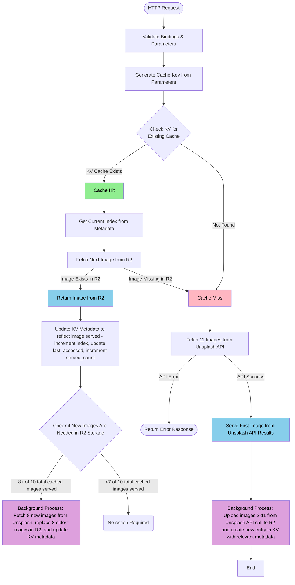

# Unsplash Cloudflare Worker

Serve random Unsplash images with intelligent caching. Perfect for dynamic backgrounds, hero images, and placeholders.

[  ](https://deploy.workers.cloudflare.com/?url=https://github.com/connorshinn/unsplash-Backgrounds)

# Features

* 🖼️ Rotating images from Unsplash deployed via free Cloudflare worker
* 🎯 Refine image results by topics, collections, or specific search terms
* ⚡ Image caching via Cloudflare R2 storage with automatic cache cleanup

# Quick Start Guide
> [!NOTE]
> Worker requires an active Cloudflare R2 storage plan, please add this to your account prior to deploying. Cloudflare offers a generous free tier (10GB-month/month storage + 1 million requests/month), so no costs will be incurred. 

## 1. Deploy Worker to Cloudflare
### Click the **Deploy to Cloudflare Workers** button above. This will:

* Fork the repository to your GitHub account
* Guide you through Cloudflare authentication
* Automatically create required resources (R2 bucket, KV namespace)
* Deploy the worker to your Cloudflare account

## **2. Add Unsplash API key:**

* Obtain a free API key from [Unsplash](https://unsplash.com/developers)
   * Sign up or log in
   * Create a new application
   * Copy your **Access Key**

* Add the API key to your worker:
   * Navigate to **[Cloudflare Workers & Pages](https://dash.cloudflare.com/?to=/:account/workers-and-pages)**
   * Select the **tinyauth-backgrounds** worker 
   * Go to **Settings** → **Variables**
   * Click **Add variable**
   * Name: `UNSPLASH_ACCESS_KEY`
   * Value: Paste your Unsplash Access Key
   * Check **Encrypt** (to make it a secret)
   * Click **Save**

## 3. Customize Worker URL
   * At the top of the Cloudflare worker page, you'll see a URL like `https://tinyauth-backgrounds.<your-account>.workers.dev`. This is your worker's base URL.
   * You can add query parameters to this URL to refine the image results. For example, `https://tinyauth-backgrounds.<your-account>.workers.dev/?topics=nature` will return images from Unsplash's Nature category.
   * The full set of parameters is available in the [Usage](#usage) section below, along with several examples.
   * All parameters are optional, though we recommend adding at least 1 topic, query, or collection to ensure high quality backgrounds. Adding image dimensions is also recommended for best performance

## 4. Add Customized Worker URL to Tinyauth
   * Update the BACKGROUND_IMAGE environment variable in your docker compose file to include your customized worker URL, e.g.:
   ```yaml
   BACKGROUND_IMAGE: https://tinyauth-backgrounds.<your-account>.workers.dev/?topics=nature&w=1920&h=1080
   ```
   * Restart your Tinyauth instance

Enjoy the new dynamic backgrounds! 🎉

# URL Examples and Parameter Details

## Basic URL Examples

```
# Random image
https://your-worker.workers.dev/

# Nature images
https://your-worker.workers.dev/?topics=nature

# Search query
https://your-worker.workers.dev/?query=mountain

# With dimensions
https://your-worker.workers.dev/?topics=wallpapers&w=1920&h=1080
```

## Available Parameters
> [!TIP]
> You can include multiple topics, collections, or queries by separating them with a comma, e.g. `&topics=nature,wallpapers`   

| Parameter | Description | Example |
|----|----|----|
| `topics` | Topic name or ID | `&topics=nature` |
| `query` | Search term | `&query=mountain` |
| `collections` | Collection ID | `&collections=1065976` |
| `w` | Width in pixels | `&w=1920` |
| `h` | Height in pixels | `&h=1080` |

> [!IMPORTANT]
> Due to limiations with the Unsplash API, collections and topics cannot be used with the query parameter

## Supported Topics
> [!NOTE]
> Unsplash maintains a set of standard topics, which are outlined below. Make sure to pass use the value in the **query parameter** column in your URL. Temporary topics can be accessed by using the topic ID as the query parameter. A full list of available topics can be accessed via the Unsplash API at https://api.unsplash.com/topics?client_id=YOUR_ACCESS_KEY  

|Example Image                                                                                                                                                   |Topic                                                                   |Query Parameter        |Description                                                                                                                                              |Current Image Count|Image Type  |
|----------------------------------------------------------------------------------------------------------------------------------------------------------------|------------------------------------------------------------------------|-----------------------|---------------------------------------------------------------------------------------------------------------------------------------------------------|-------------------|------------|
|                                                  |[3D](https://unsplash.com/t/3d)                                         |3d                     |Vectors that use shading, gradients, and perspective to create a sense of volume and space — adding a lifelike, tactile quality to digital illustrations.|823                |Illustration|
|                                                   |[3D Renders](https://unsplash.com/t/3d-renders)                         |3d-renders             |This category showcases digitally rendered creations that blend technology and art, exploring the limitless potential of digital creativity.             |11997              |Photo       |
|                                                   |[Animals](https://unsplash.com/t/animals)                               |animals                |Showcasing the creatures that make our world wild, this category celebrates the wonders of the animal kingdom.                                           |14452              |Photo       |
|                                                   |[Architecture & Interiors](https://unsplash.com/t/architecture-interior)|architecture-interior  |Celebrating the artistry of spaces, this category highlights stunning photography of architecture and interiors.                                         |19318              |Photo       |
|                                                   |[Experimental](https://unsplash.com/t/experimental)                     |experimental           |This category invites photographers to explore new techniques and perspectives, pushing creative boundaries.                                             |11878              |Photo       |
|                                                         |[Fashion & Beauty](https://unsplash.com/t/fashion-beauty)               |fashion-beauty         |In this category, photographers turn fashion and beauty into art, capturing trends and personal style through expert composition.                        |10569              |Photo       |
|                                                         |[Film](https://unsplash.com/t/film)                                     |film                   |This category celebrates film's timeless beauty, capturing moments with rich textures and unique colors that define analog photography.                  |13143              |Photo       |
|                                                  |[Flat](https://unsplash.com/t/flat)                                     |flat                   |A 2D illustration style showcasing clean lines, bold colors and simple shapes.                                                                           |882                |Illustration|
|                                                  |[Hand Drawn](https://unsplash.com/t/hand-drawn)                         |hand-drawn             |From sketchy lines to textured strokes, this topic highlights digital works that mimic the look and feel of hand-drawn art.                              |868                |Illustration|
|                                                  |[Icons](https://unsplash.com/t/icons)                                   |icons                  |This topic features simple, versatile symbols and icons designed to fit any project.                                                                     |800                |Illustration|
|                                                  |[Line Art](https://unsplash.com/t/line-art)                             |line-art               |From delicate outlines to bold strokes, this topic highlights crisp, minimal line drawings designed to add a timeless and adaptable style to any project.|762                |Illustration|
|                                                         |[Nature](https://unsplash.com/t/nature)                                 |nature                 |This category showcases nature’s beauty, from vast landscapes to macro details, transporting viewers to the outdoors.                                    |32436              |Photo       |
|                                                  |[Patterns](https://unsplash.com/t/patterns)                             |patterns               |Patterns and designs that use shape, color, and symmetry to create visual rhythm and texture — from bold geometrics to organic motifs.                   |807                |Illustration|
|                                                   |[People](https://unsplash.com/t/people)                                 |people                 |In this category, photographers capture emotions, cultures, and stories through candid moments and formal portraits.                                     |13757              |Photo       |
|                                                         |[Street Photography](https://unsplash.com/t/street-photography)         |street-photography     |From quiet passages in charming towns to the hustle and bustle of cities, this category examines street photography in every form.                       |13467              |Photo       |
|                                                   |[Textures](https://unsplash.com/t/textures-patterns)                    |textures-patterns      |Whether you’re looking for stunning macro-photography or shots of complex architectural shapes — you’ve come to the right place.                         |18183              |Photo       |
|                                                         |[Travel](https://unsplash.com/t/travel)                                 |travel                 |Explore the globe through captivating landscapes and vibrant cultures in this Travel category, celebrating diverse destinations worldwide.               |9555               |Photo       |
|                                                        |[Wallpapers](https://unsplash.com/t/illustration-wallpapers)            |illustration-wallpapers|Explore illustrations that are perfect for bringing personality and style to your desktop or mobile background.                                          |858                |Illustration|
|                                                         |[Wallpapers](https://unsplash.com/t/wallpapers)                         |wallpapers             |From epic drone shots to inspiring moments in nature — enjoy the best background for your desktop or mobile.                                             |16822              |Photo       |


# Caching Architecture

## Overview

The initial iteration of this tool called the Unsplash API directly on every request. However, due to how the API serves images, there was an extended delay between the initial request and when the image was loaded. To address this, we implemented a caching system to serve images from Cloudflare instead. The caching system uses  KV (Key-Value store) for metadata and R2 (object storage) for image files. It implements a smart rotation system that serves different images on each request while maintaining fast response times through pre-caching.

## Caching Flow Diagram



**Caching:**

* Stores 10 images per parameter set in R2 + KV
* Rotates through images on each request
* Refreshes 8 oldest images after every 8 requests
* No client-side caching (fresh images on every page refresh)

**First Request:**


1. Cache miss → 302 redirect to Unsplash
2. Background: Fetch and cache 10 images

**Subsequent Requests:**


1. Cache hit → Serve next image in rotation
2. Every 8 requests → Refresh 8 oldest images

## Viewing Logs

To view your worker's logs:


1. Go to [Cloudflare Dashboard](https://dash.cloudflare.com)
2. Navigate to **Workers & Pages**
3. Click on your **unsplash-worker**
4. Click **Logs** tab
5. Click **Begin log stream**

You'll see real-time logs of requests, cache hits/misses, and any errors.

## Troubleshooting

**Worker returns 502 or errors:**


1. Check that your Unsplash API key is set correctly:
   * Cloudflare Dashboard → Workers & Pages → unsplash-worker → Settings → Variables
   * Verify `UNSPLASH_ACCESS_KEY` is present and encrypted
2. Verify your API key is valid at [unsplash.com/oauth/applications](https://unsplash.com/oauth/applications)
3. Check the logs (see "Viewing Logs" section above)

**Images not rotating:**

* Clear browser cache or use Incognito mode
* Make more requests (cycles through 10 images)

**Topics not working:**

* Use supported topic slugs (see list above)
* Check the logs for error messages

## Cost

Cloudflare's free tier is generous and covers typical usage:

| Service | Free Tier |
|----|----|
| Workers | 100,000 requests/day |
| R2 Storage | 10 GB |
| R2 Operations | 10M reads, 1M writes/month |
| KV Operations | 100,000 reads/day, 1,000 writes/day |

**Typical usage: $0/month** ✅

## Advanced

**Custom domain:**


1. Go to Cloudflare Dashboard → Workers & Pages → unsplash-worker
2. Click **Triggers** tab
3. Click **Add Custom Domain**
4. Enter your domain (must be on Cloudflare)
5. Click **Add Custom Domain**

**Rate limits:**

* Demo API: 50 requests/hour
* Production API: 5,000 requests/hour (apply at [unsplash.com/oauth/applications](https://unsplash.com/oauth/applications))

**Viewing cached data:**


1. Go to Cloudflare Dashboard
2. For R2 images: **R2** → **unsplash-cache** bucket
3. For KV metadata: **Workers & Pages** → **KV** → **UNSPLASH_CACHE_METADATA**

## Attribution

This worker uses the [Unsplash API](https://unsplash.com/developers). Please:

* Provide photographer attribution (see `X-Unsplash-Photographer` header)
* Link back to Unsplash when possible (see `X-Image-Source-URL` header)
* Follow [Unsplash API Guidelines](https://help.unsplash.com/en/articles/2511245-unsplash-api-guidelines)

## License

MIT License