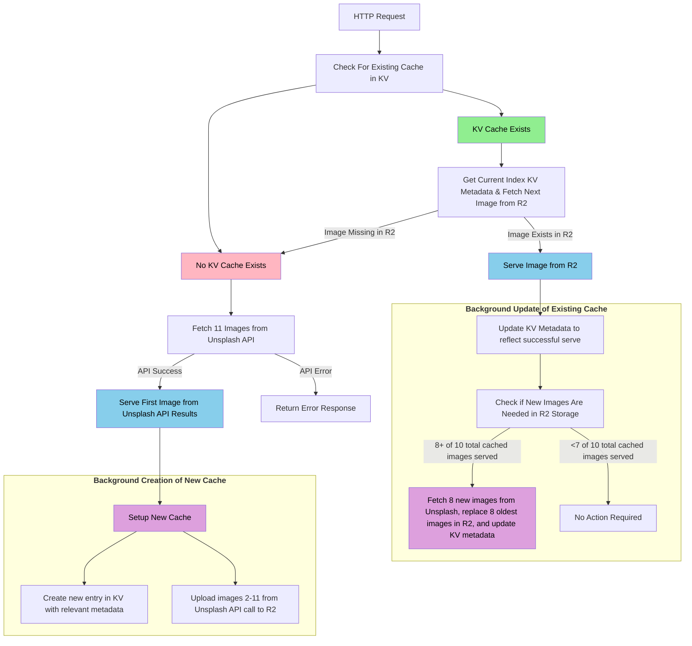
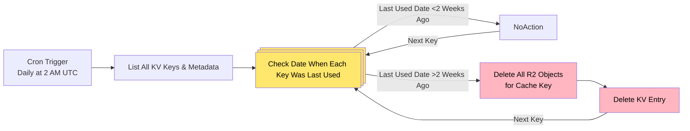

# Rotating Unsplash Images Cloudflare Worker

Image service built on Cloudflare Workers that delivers rotating Unsplash photos. Features include:

* 🖼️ **Rotating images from Unsplash deployed via free Cloudflare worker**
* 🎯 **Refine image results by topics, collections, or specific search terms**
* ⚡ **Image caching via Cloudflare R2 storage with automatic cache cleanup**
* 🔄 **Cache refresh to keep images fresh**
* 🔑 **Originally designed to provide dynamic backgrounds for [Tinyauth](https://github.com/steveiliop56/tinyauth), but worker can be deployed on any project**

# Quick Start Guide
> [!NOTE]
> Worker requires an active Cloudflare R2 storage plan, please add this to your account prior to deploying. Cloudflare R2 is technically a pay-as-you-go service, though a generous free tier is offered (10GB-month/month storage + 1 million requests/month). As a result, typical usage of this worker should be well within the free tier limits and not incur any costs.   

## 1. Deploy Worker to Cloudflare
Click the **Deploy to Cloudflare** button below. 

[  ](https://deploy.workers.cloudflare.com/?url=https://github.com/connorshinn/unsplash-Backgrounds)

This will:

* **Fork the repository** to your GitHub account
* Guide you through ***Cloudflare authentication**
* Automatically **create required resources** (R2 bucket, KV namespace)
* **Deploy the worker** to your Cloudflare account

## 2. Add Unsplash API key:

* Once the worker is deployed, obtain a free API key from [Unsplash](https://unsplash.com/developers)
   * Sign up or log in
   * Create a new application
   * Copy your **Access Key**

* Add the API key to your worker:
   * Navigate to **[Cloudflare Workers & Pages](https://dash.cloudflare.com/?to=/:account/workers-and-pages)**
   * Select the **tinyauth-backgrounds** worker 
   * Go to **Settings** → **Variables**
   * Click **Add variable**
   * Name: `UNSPLASH_ACCESS_KEY`
   * Value: Paste your Unsplash Access Key
   * Check **Encrypt** (to make it a secret)
   * Click **Save**

## 3. Customize Worker URL
   * At the top of the Cloudflare worker page, you'll see a URL that looks like this: `https://tinyauth-backgrounds.<your-account>.workers.dev`. 
    **This is your worker's base URL.**
   * You can add **query parameters** to the end of your base URL to **refine the image results**. For example, `https://tinyauth-backgrounds.<your-account>.workers.dev/?topics=nature` will return images from Unsplash's Nature category.
   * The full set of parameters is available in the **[Usage](#usage)** section below, along with several examples.
   * All parameters are optional, though we recommend adding **at least 1 topic, query, or collection** to ensure high quality backgrounds. Adding **image dimensions is also recommended** for best performance

## 4. Add Customized Worker URL to Tinyauth
   * Once you have identified which parameters you want to use you should have a URL that looks something like this: `https://tinyauth-backgrounds.<your-account>.workers.dev/?topics=nature&w=1920&h=1080`. 
   * The final step is to **add this URL to your Tinyauth instance**. To update, simply add the BACKGROUND_IMAGE environment variable to your docker compose file to include your customized worker URL, e.g.:
   ```yaml
   BACKGROUND_IMAGE: https://tinyauth-backgrounds.<your-account>.workers.dev/?topics=nature&w=1920&h=1080
   ```
   * **Restart** your Tinyauth instance

Enjoy the new dynamic backgrounds! 🎉

# URL Examples and Parameter Details

## Available Parameters

> [!TIP]
> You can include **multiple topics, collections, or queries by separating them with a comma**, e.g. `&topics=nature,wallpapers`   

| Parameter | Description | Example |
|----|----|----|
| `topics` | Topic name or ID | `&topics=nature` |
| `query` | Search term | `&query=mountain` |
| `collections` | Collection ID | `&collections=1065976` |
| `w` | Width in pixels | `&w=1920` |
| `h` | Height in pixels | `&h=1080` |

> [!IMPORTANT]
> Due to limiations with the Unsplash API, **collections and topics cannot be used with the query parameter**

## Available Topics
> [!NOTE]
> Unsplash maintains a set of **standard topics**, which are outlined below. To include one or more of these topics in your URL, make sure to pass the value in the **parameter** column in your URL. Temporary topics can be accessed by using the topic ID as the parameter. A full list of available topics is available via the Unsplash API at https://api.unsplash.com/topics?client_id=YOUR_ACCESS_KEY  

|Example Image                                                                                                                                                   |Topic                                                                   |Parameter        |Description                                                                                                                                              |Current Image Count|Image Type  |
|----------------------------------------------------------------------------------------------------------------------------------------------------------------|------------------------------------------------------------------------|-----------------------|---------------------------------------------------------------------------------------------------------------------------------------------------------|-------------------|------------|
|                                                  |[3D](https://unsplash.com/t/3d)                                         |3d                     |Vectors that use shading, gradients, and perspective to create a sense of volume and space — adding a lifelike, tactile quality to digital illustrations.|823                |Illustration|
|                                                   |[3D Renders](https://unsplash.com/t/3d-renders)                         |3d-renders             |This category showcases digitally rendered creations that blend technology and art, exploring the limitless potential of digital creativity.             |11997              |Photo       |
|                                                   |[Animals](https://unsplash.com/t/animals)                               |animals                |Showcasing the creatures that make our world wild, this category celebrates the wonders of the animal kingdom.                                           |14452              |Photo       |
|                                                   |[Architecture & Interiors](https://unsplash.com/t/architecture-interior)|architecture-interior  |Celebrating the artistry of spaces, this category highlights stunning photography of architecture and interiors.                                         |19318              |Photo       |
|                                                   |[Experimental](https://unsplash.com/t/experimental)                     |experimental           |This category invites photographers to explore new techniques and perspectives, pushing creative boundaries.                                             |11878              |Photo       |
|                                                         |[Fashion & Beauty](https://unsplash.com/t/fashion-beauty)               |fashion-beauty         |In this category, photographers turn fashion and beauty into art, capturing trends and personal style through expert composition.                        |10569              |Photo       |
|                                                         |[Film](https://unsplash.com/t/film)                                     |film                   |This category celebrates film's timeless beauty, capturing moments with rich textures and unique colors that define analog photography.                  |13143              |Photo       |
|                                                  |[Flat](https://unsplash.com/t/flat)                                     |flat                   |A 2D illustration style showcasing clean lines, bold colors and simple shapes.                                                                           |882                |Illustration|
|                                                  |[Hand Drawn](https://unsplash.com/t/hand-drawn)                         |hand-drawn             |From sketchy lines to textured strokes, this topic highlights digital works that mimic the look and feel of hand-drawn art.                              |868                |Illustration|
|                                                  |[Icons](https://unsplash.com/t/icons)                                   |icons                  |This topic features simple, versatile symbols and icons designed to fit any project.                                                                     |800                |Illustration|
|                                                  |[Line Art](https://unsplash.com/t/line-art)                             |line-art               |From delicate outlines to bold strokes, this topic highlights crisp, minimal line drawings designed to add a timeless and adaptable style to any project.|762                |Illustration|
|                                                         |[Nature](https://unsplash.com/t/nature)                                 |nature                 |This category showcases nature’s beauty, from vast landscapes to macro details, transporting viewers to the outdoors.                                    |32436              |Photo       |
|                                                  |[Patterns](https://unsplash.com/t/patterns)                             |patterns               |Patterns and designs that use shape, color, and symmetry to create visual rhythm and texture — from bold geometrics to organic motifs.                   |807                |Illustration|
|                                                   |[People](https://unsplash.com/t/people)                                 |people                 |In this category, photographers capture emotions, cultures, and stories through candid moments and formal portraits.                                     |13757              |Photo       |
|                                                         |[Street Photography](https://unsplash.com/t/street-photography)         |street-photography     |From quiet passages in charming towns to the hustle and bustle of cities, this category examines street photography in every form.                       |13467              |Photo       |
|                                                   |[Textures](https://unsplash.com/t/textures-patterns)                    |textures-patterns      |Whether you’re looking for stunning macro-photography or shots of complex architectural shapes — you’ve come to the right place.                         |18183              |Photo       |
|                                                         |[Travel](https://unsplash.com/t/travel)                                 |travel                 |Explore the globe through captivating landscapes and vibrant cultures in this Travel category, celebrating diverse destinations worldwide.               |9555               |Photo       |
|                                                        |[Wallpapers](https://unsplash.com/t/illustration-wallpapers)            |illustration-wallpapers|Explore illustrations that are perfect for bringing personality and style to your desktop or mobile background.                                          |858                |Illustration|
|                                                         |[Wallpapers](https://unsplash.com/t/wallpapers)                         |wallpapers             |From epic drone shots to inspiring moments in nature — enjoy the best background for your desktop or mobile.                                             |16822              |Photo       |


# Caching Architecture

## Background Context

The initial iteration of this tool called the Unsplash API directly on every request. However, due the underlying functionality of the API, there was an extended delay between the initial request and when the image was loaded. To address this, we implemented a caching system to serve images from Cloudflare instead. The caching system uses a KV (Key-Value store) for metadata and R2 (object storage) for image files. It implements a smart rotation system that serves different images on each request while maintaining fast response times by avoiding API calls for each request.

## Overview of Caching System

* At a high level, the system cache is made up of two primary components:
   * **KV Namespace**: Stores cache metadata (references to images in R2 bucket, rotation index, timestamps)
   * **R2 Bucket**: Stores actual image files

### KV Namespace and Cache Key/Value Generation

* Each **unique combination** of request parameters has its **own key/value pair**.
* The **first time** a unique set of parameters is called, the worker will identify that a **new cache key** will need to be created. This triggers a query to the Unsplash API to fetch *11 images* - **1 to serve immediately and 10 to cache for future requests**. As a result, **the first request for a unique set of parameters will take longer to serve** as the cache is not yet available 
* Prior to creating a cache key, the parameters are **standardized to avoid potential duplicates**. Specifically, parameters are sorted alphabetically (as are values within each parameter). 

**Examples of Keys Used in KV Namespace**
|Original URL Parameters                                                                                                                                         |Key Used in KV Namespace                                                |
|----------------------------------------------------------------------------------------------------------------------------------------------------------------|------------------------------------------------------------------------|
|?topics=wallpapers&w=1920&h=1080                                                                                                                                |height=1080&topics=wallpapers&width=1920                                |
|?w=1920&h=1080&topics=wallpapers                                                                                                                                |height=1080&topics=wallpapers&width=1920                                |
|?topics=nature,animals&w=3840                                                                                                                                   |topics=animals,nature&w=3840                                            |

> [!NOTE]
> The first two sets of URL parameters would ultimately use the same key in the KV namespace, as the standardized key is `height=1080&topics=wallpapers&width=1920` for both. 

<details>

<summary>View Example of Value Stored in KV Namespace</summary>

```json
{
  "cache_key": "height=1080&topics=nature&width=1920",
  "total_images": 10,
  "next_index": 0,
  "served_count": 4,
  "images": [
    { "r2_key": "height=1080&topics=nature&width=1920_0", "photographer": "Sharad Bhat", "photo_id": "K13ZyQ8aUO0", "content_type": "image/jpeg" },
    { "r2_key": "height=1080&topics=nature&width=1920_1", "photographer": "Mathew Schwartz", "photo_id": "GjzJFMnJZYg", "content_type": "image/jpeg" },
    { "r2_key": "height=1080&topics=nature&width=1920_2", "photographer": "Willian Justen de Vasconcellos", "photo_id": "HI5rD5zbU2o", "content_type": "image/jpeg" },
    { "r2_key": "height=1080&topics=nature&width=1920_3", "photographer": "Yarenci Hdz", "photo_id": "gq7Ag7ANQk8", "content_type": "image/jpeg" },
    { "r2_key": "height=1080&topics=nature&width=1920_4", "photographer": "magnezis magnestic", "photo_id": "UQSHkNe57EI", "content_type": "image/jpeg" },
    { "r2_key": "height=1080&topics=nature&width=1920_5", "photographer": "Jovyn Chamb", "photo_id": "iWMfiInivp4", "content_type": "image/jpeg" },
    { "r2_key": "height=1080&topics=nature&width=1920_6", "photographer": "Leo_Visions", "photo_id": "nzdvmBa8lb0", "content_type": "image/jpeg" },
    { "r2_key": "height=1080&topics=nature&width=1920_7", "photographer": "Sabrina Brunton", "photo_id": "vdweI3dPVnI", "content_type": "image/jpeg" },
    { "r2_key": "height=1080&topics=nature&width=1920_8", "photographer": "Irina Iriser", "photo_id": "DuObvMLmc8M", "content_type": "image/jpeg" },
    { "r2_key": "height=1080&topics=nature&width=1920_9", "photographer": "Colin Watts", "photo_id": "1-p_2jicsVU", "content_type": "image/jpeg" }
  ],
  "last_accessed": 1761073594497
}
```
</details>

### R2 Storage and Image Rotation

* Each unique key in the KV namespace has a corresponding set of **10 images stored in the R2 bucket**. 

* Images are named based on the **cache key and their index** in the rotation. For example, an image with the cache key `height=1080&topics=wallpapers&width=1920` and an index of 0 would be named `height=1080&topics=wallpapers&width=1920_0`.

* When a call is made using a set of parameters with an existing cache, the system will read the `next_index` from the KV metadata and serve the **next image in the rotation**. The `next_index` is tracked in the KV metadata and **incremented after each serve** (wrapping back to 0 after 9). This ensures a **new image is served on each request** without the need to query the Unsplash API each time. 

* So, for example, the second time you call `https://tinyauth-backgrounds.<your-account>.workers.dev/?topics=wallpapers&w=1920&h=1080`, it will serve `height=1080&topics=wallpapers&width=1920_1.jpg`, the third time it will serve `height=1080&topics=wallpapers&width=1920_2.jpg`, and so on.

### Cache Refresh Strategy
* To avoid seeing the same image multiple times, **a refresh is triggered automatically once 8 of the 10 images** from the cache have been served. 
* This refresh is triggered in the background and **replaces any images that have already been seen** with fresh ones from the Unsplash API via the `/photos/random` endpoint
* Triggering a refresh after 8 of the 10 images have been seen ensures that there are **always 2 images in the rotation that have not yet been seen**. This ensures that the cache can still be used **even if a request is made while the background refresh is in progress**. 

### Cache Diagram
A more detailed diagram of the caching system is provided below. 

<details>

<summary>Viewed Detailed Cache Diagram</summary>

</details>

### Cache Cleanup
* To avoid unbounded storage, a cron job is setup to run daily at 2:00 AM UTC to clean up old cache entries. 
* The worker will iterate through each key in the KV namespace and check the `last_accessed` timestamp. Any keys that have not been accessed in more than 2 weeks are deleted from the KV namespace, and their corresponding images are deleted from the R2 bucket. 

<details>

<summary>View Cron Job Workflow</summary>


</details>

## Attribution

* This worker uses the [Unsplash API](https://unsplash.com/developers). Photographer attribution is automatically passed as a header with each request to comply with [Unsplash API Guidelines](https://help.unsplash.com/en/articles/2511245-unsplash-api-guidelines) (see `X-Unsplash-Photographer` header). 
* Many thanks to [Tinyauth](https://github.com/steveiliop56/tinyauth) for the inspiration and use case!

## License

MIT License